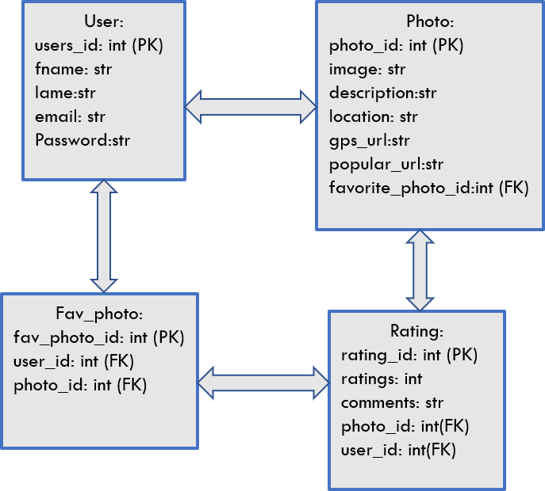

# ArtCritique
## Overview:
The main idea of this web application is for an artist who seek an evaluation on their artwork through ratings/comments. It also showcases the location details of an image.
## Techonologies:
* Python
* Flask
* PostgreSQL
* SQLAlchemy ORM
* Jinja2
* JavaScript(JQuery/AJAX, JSON)
* HTML
* BootStrap
* CSS
* Google Maps API
## Database:
Relational database where each user can rate/comment multiple photos, make multiple favorites while each photo can have many ratings/comments.

## Features:
* User Handling(User registration, Login, Logout) 
* Diplay of all artist's photos
* Select a particular image
* Review/Comment, make it a favorite
* Statistics of rated/comments of photos
* Make a Favorite phot.
* Statastics of all users.
* Display the location on Google Maps
* Navigates to a popular site for further details.
